```{r setup, include=FALSE}
library(ggplot2)
library(dplyr)
library(cowplot)
library(plotly)
library(kableExtra)
library(pcadapt)
library(corrplot)
library(emojifont)
library(OutFLANK)
library(highcharter)
library(robust)
options(htmltools.dir.version = FALSE)
knitr::opts_chunk$set(echo = FALSE, 
                      warning = FALSE,
                      fig.align = "center", 
                      fig.height = 5, 
                      fig.width = 8, 
                      dpi = 300, 
                      cache = TRUE)

# The palette with black:
cbbPalette <- c("#000000", 
                "#E69F00", 
                "#56B4E9", 
                "#009E73", 
                "#F0E442", 
                "#0072B2", 
                "#D55E00", 
                "#CC79A7")
```

background-image: url("figure/oneness.jpg")
background-size: cover
class: coupure bottom

# La génétique des populations

<div id="rsn">
  <p>1/45</p>
</div>

---

<div id="rsn">
  <p>2/45</p>
</div>


### La génétique des populations

.left-column[

<br>

<br>


]

.right-column[

> « Il est bon de rappeler que ce qui nous rend semblables est plus important que ce qui nous rend différents. Les milliards d'êtres humains éparpillés sur toute la planète se différencient par la couleur de la peau et par la forme du corps, par la langue et par la culture. Et cette variété, qui témoigne de notre capacité à changer, à nous adapter à des milieux différents et à y développer des modes de vie originaux, est la meilleure garantie pour l'avenir de l'espèce humaine. Les connaissances que nous avons acquises sur nous-mêmes montrent cependant que toute cette diversité, comme la surface changeante des océans ou de la voûte du ciel, est bien peu de chose par rapport à cet immense patrimoine que nous avons en commun, nous, les humains. »
>
> L. Cavalli-Sforza (1994)

]


???

Anecdote par rapport aux échanges en covoiturage

Phrase canon pour deux raisons :
- apologie de la diversité
- va nous permettre de mieux comprendre les enjeux de ce travail de thèse (hopefully)

Mots importants : différencient, variété, capacité à changer, adapter à des milieux différents, garantie pour l'avenir de l'espèce

Si cette citation vous semble claire, on peut quasiment passer à la partie suivante 


---
background-image: url("figure/tibet.jpg")
background-size: cover

<div id="rsn">
  <p>3/45</p>
</div>

---
background-image: url("figure/tibet.jpg")
background-size: cover

<div id="rectangle"> 

  <p><ul> Peut-on déterminer si des gènes ont permis à des individus de vivre dans des conditions environnementales spécifiques ? </ul></p>
  
</div>

<div id="rsn">
  <p>3/45</p>
</div>


---
background-image: url("figure/tibet.jpg")
background-size: cover

<div id="rectangle"> 

  <p><ul> Peut-on déterminer si des gènes ont permis à des individus de vivre dans des conditions environnementales spécifiques ? </ul></p>
  
  <center>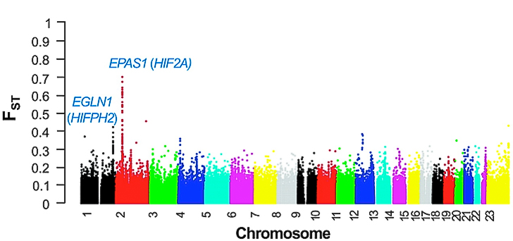</center>
  <center><p> (Xu et al., 2010) </p></center>
</div>

<div id="rsn">
  <p>3/45</p>
</div>

---
<div id="rsn">
  <p>4/45</p>
</div>

### Données génomiques

#### <center> Évolution des coûts de séquençage depuis 2001 (Wetterstrand, 2013) </center>

```{r}
df <- read.csv("data/seqcost2015_4.csv")
df %>%
  mutate(log10CpG = log10(Cost.per.Genome)) %>%
  ggplot(aes(x = as.Date(Date), y = log10CpG)) +
  geom_line(color = cbbPalette[6], size = 1.5) +
  scale_y_continuous(breaks = 1:8,
                     labels = c("10",
                                "100",
                                "1K",
                                "10K",
                                "100K",
                                "1M",
                                "10M",
                                "100M")) +
  xlab("Année") +
  ylab("Coût par génôme (en dollars)") +
  scale_x_date(date_minor_breaks = "1 year") +
  theme_bw() +
  theme(text = element_text(size = 15))

```

---
<div id="rsn">
  <p>5/45</p>
</div>

### Polymorphisme d'un seul nucléotide (SNP)


```{r}
set.seed(5)

N <- 20
nuclA1 <- sample(c("A", "C", "G", "T"), size = N, replace = TRUE)
nuclB1 <- nuclA1
nuclC1 <- nuclA1
nuclD1 <- nuclA1

tA <- rep("DNA1", N)
tB <- rep("DNA2", N)
tC <- rep("DNA3", N)
tD <- rep("DNA4", N)

SNPA.df <- data.frame(x1 = 1:N,
                      x2 = 2:(N + 1),
                      y1 = rep(1, N), 
                      y2 = rep(2, N), 
                      t = tA,
                      r = nuclA1,
                      marker.type = "SNP")

SNPB.df <- data.frame(x1 = 1:N,
                      x2 = 2:(N + 1),
                      y1 = rep(3, N), 
                      y2 = rep(4, N), 
                      t = tB,
                      r = nuclB1,
                      marker.type = "SNP")

SNPC.df <- data.frame(x1 = 1:N,
                      x2 = 2:(N + 1),
                      y1 = rep(5, N), 
                      y2 = rep(6, N), 
                      t = tC,
                      r = nuclC1,
                      marker.type = "SNP")

SNPD.df <- data.frame(x1 = 1:N,
                      x2 = 2:(N + 1),
                      y1 = rep(7, N), 
                      y2 = rep(8, N), 
                      t = tD,
                      r = nuclD1,
                      marker.type = "SNP")

rbind(SNPA.df, SNPB.df, SNPC.df, SNPD.df) %>%
  mutate(t = factor(t,
                    levels = c("DNA1",
                               "DNA2",
                               "DNA3",
                               "DNA4"),
                    ordered = TRUE)) %>%
  ggplot() +
  coord_fixed() +
  scale_fill_manual(values = cbbPalette[c(3, 3, 6, 6)]) +
  geom_rect(mapping = aes(xmin = x1,
                          xmax = x2,
                          ymin = y1,
                          ymax = y2,
                          fill = t),
            color = "black",
            alpha = 0.75) +
  geom_text(aes(x = x1 + (x2 - x1) / 2,
                y = y1 + (y2 - y1) / 2,
                label = r),
            size = 4) +
  theme_bw() +
  theme(axis.text.x = element_blank(),
        axis.text.y = element_blank(),
        axis.ticks = element_blank(),
        axis.title.x = element_blank(),
        axis.title.y = element_blank(),
        legend.position = "none",
        plot.title = element_text(hjust = 0.5),
        panel.border = element_blank(),
        panel.grid = element_blank())

```


---
<div id="rsn">
  <p>5/45</p>
</div>

### Polymorphisme d'un seul nucléotide (SNP)

```{r}
set.seed(5)

idx.SNP <- sample(1:N, size = 1)
if (nuclA1[idx.SNP] == "A" || nuclA1[idx.SNP] == "T") {
  nuclB1[idx.SNP] <- sample(c("C", "G"), size = 1)
} else if (nuclA1[idx.SNP] == "C" || nuclA1[idx.SNP] == "G") {
  nuclB1[idx.SNP] <- sample(c("A", "T"), size = 1)
}

tA[idx.SNP] <- "X"
tB[idx.SNP] <- "X"
tC[idx.SNP] <- "X"
tD[idx.SNP] <- "X"

SNPA.df <- data.frame(x1 = 1:N,
                      x2 = 2:(N + 1),
                      y1 = rep(1, N), 
                      y2 = rep(2, N), 
                      t = tA,
                      r = nuclA1,
                      marker.type = "SNP")

SNPB.df <- data.frame(x1 = 1:N,
                      x2 = 2:(N + 1),
                      y1 = rep(3, N), 
                      y2 = rep(4, N), 
                      t = tB,
                      r = nuclB1,
                      marker.type = "SNP")

SNPC.df <- data.frame(x1 = 1:N,
                      x2 = 2:(N + 1),
                      y1 = rep(5, N), 
                      y2 = rep(6, N), 
                      t = tC,
                      r = nuclC1,
                      marker.type = "SNP")

SNPD.df <- data.frame(x1 = 1:N,
                      x2 = 2:(N + 1),
                      y1 = rep(7, N), 
                      y2 = rep(8, N), 
                      t = tD,
                      r = nuclD1,
                      marker.type = "SNP")

rbind(SNPA.df, SNPB.df, SNPC.df, SNPD.df) %>%
  mutate(t = factor(t,
                    levels = c("DNA1",
                               "DNA2",
                               "DNA3",
                               "DNA4",
                               "X"),
                    ordered = TRUE)) %>%
  ggplot() +
  coord_fixed() +
  scale_fill_manual(values = cbbPalette[c(3, 3, 6, 6, 7)]) +
  geom_rect(mapping = aes(xmin = x1,
                          xmax = x2,
                          ymin = y1,
                          ymax = y2,
                          fill = t),
            color = "black",
            alpha = 0.75) +
  geom_text(aes(x = x1 + (x2 - x1) / 2,
                y = y1 + (y2 - y1) / 2,
                label = r),
            size = 4) +
  theme_bw() +
  theme(axis.text.x = element_blank(),
        axis.text.y = element_blank(),
        axis.ticks = element_blank(),
        axis.title.x = element_blank(),
        axis.title.y = element_blank(),
        legend.position = "none",
        plot.title = element_text(hjust = 0.5),
        panel.border = element_blank(),
        panel.grid = element_blank())

```


---
<div id="rsn">
  <p>6/45</p>
</div>

### Des chiffres et des lettres

.pull-left[

```{r}
N <- 6
SNP.lab <- c("A", "T", "A", "A", "A", "A",
             "C", "C", "C", "A", "A", "A",
             "G", "T", "T", "G", "G", "G",
             "T", "T", "T", "T", "T", "C")
SNP.x <- rep(1:6, 4)
SNP.y <- c(rep(1, 6), rep(2, 6), rep(3, 6), rep(4, 6))

geno.lab <- c("1", "0", "0",
              "0", "1", "2",
              "1", "1", "0",
              "2", "2", "1")
geno.x <- rep(1:3, 4)
geno.y <- c(rep(1, 3), rep(2, 3), rep(3, 3), rep(4, 3))

ind <- rep(as.character(c(1, 1, 2, 2, 3, 3)), 4)

SNP.df <- data.frame(x1 = SNP.x,
                     x2 = SNP.x + 1,
                     y1 = SNP.y,
                     y2 = SNP.y + 1,
                     lab = SNP.lab,
                     ind = ind)

geno.df <- data.frame(x1 = geno.x,
                      x2 = geno.x + 1,
                      y1 = geno.y,
                      y2 = geno.y + 1,
                      lab = geno.lab,
                      ind = rep(as.character(1:3), 4))

BIM.df <- data.frame(x1 = c(1, 2, 1, 2, 1, 2, 1, 2),
                     x2 = c(1, 2, 1, 2, 1, 2, 1, 2) + 1,
                     y1 = c(1, 1, 2, 2, 3, 3, 4, 4),
                     y2 = c(1, 1, 2, 2, 3, 3, 4, 4) + 1,
                     lab = c("A", "T", "C", "A", "G", "T", "C", "T"),
                     ind = rep(c("4", "5"), 4),
                     data = "bim")

p1 <- SNP.df %>% 
  ggplot() +
  coord_fixed() +
  geom_rect(mapping = aes(xmin = x1,
                          xmax = x2,
                          ymin = y1,
                          ymax = y2,
                          fill = ind),
            color = "black",
            alpha = 0.75) +
  geom_text(aes(x = x1 + (x2 - x1) / 2,
                y = y1 + (y2 - y1) / 2,
                label = lab),
            size = 15) +
  scale_fill_manual(values = cbbPalette[c(3, 6, 7)]) +
  xlab("Individus") +
  ylab("SNPs") +
  theme_bw() +
  theme(axis.text.x = element_blank(),
        axis.text.y = element_blank(),
        axis.title = element_text(size = 25, face = "bold"),
        axis.ticks = element_blank(),
        legend.position = "none",
        plot.title = element_text(hjust = 0.5),
        panel.border = element_blank(),
        panel.grid = element_blank(),
        text = element_text(size = 15))

print(p1)
```

]

.pull-right[

```{r}
p3 <- BIM.df %>% 
  ggplot() +
  coord_fixed() +
  scale_fill_manual(name = "",
                    labels = c("Référence", "Alternatif"),
                    values = c("#E69F00", "#009E73")) +
  geom_rect(mapping = aes(xmin = x1,
                          xmax = x2,
                          ymin = y1,
                          ymax = y2,
                          fill = ind),
            color = "black",
            alpha = 0.75) +
  geom_text(aes(x = x1 + (x2 - x1) / 2,
                y = y1 + (y2 - y1) / 2,
                label = lab),
            size = 15) +
  theme_bw() +
  theme(axis.text.x = element_blank(),
        axis.text.y = element_blank(),
        axis.ticks = element_blank(),
        axis.title.x = element_blank(),
        axis.title.y = element_blank(),
        plot.title = element_text(hjust = 0.5),
        panel.border = element_blank(),
        panel.grid = element_blank(),
        text = element_text(size = 15),
        legend.text = element_text(size = 25),
        legend.key.size = unit(15, "mm"))

print(p3)
```

]

---
<div id="rsn">
  <p>6/45</p>
</div>

### Des chiffres et des lettres

.pull-left[

```{r}
print(p1)
```

```{r}
p2 <- geno.df %>% 
  ggplot() +
  coord_fixed() +
  geom_rect(mapping = aes(xmin = x1,
                          xmax = x2,
                          ymin = y1,
                          ymax = y2,
                          fill = ind),
            color = "black",
            alpha = 0.75) +
  geom_text(aes(x = x1 + (x2 - x1) / 2,
                y = y1 + (y2 - y1) / 2,
                label = lab),
            size = 15) +
  scale_fill_manual(values = cbbPalette[c(3, 6, 7)]) +
  xlab("Individus") +
  ylab("SNPs") +
  theme_bw() +
  theme(axis.text.x = element_blank(),
        axis.text.y = element_blank(),
        axis.title = element_text(size = 25, face = "bold"),
        axis.ticks = element_blank(),
        legend.position = "none",
        plot.title = element_text(hjust = 0.5),
        panel.border = element_blank(),
        panel.grid = element_blank(),
        text = element_text(size = 15))

print(p2)
```

]

.pull-right[

```{r}
print(p3)
```

]

---
background-image: url("figure/arabidopsis.jpg")
background-size: cover
class: bottom coupure 

# Adaptation locale

<div id="rsn">
  <p>7/45</p>
</div>


---
<div id="rsn">
  <p>8/45</p>
</div>

### L'indice de fixation

Allèle alternatif : C

.pull-left[
#### <center> Population 1
<center>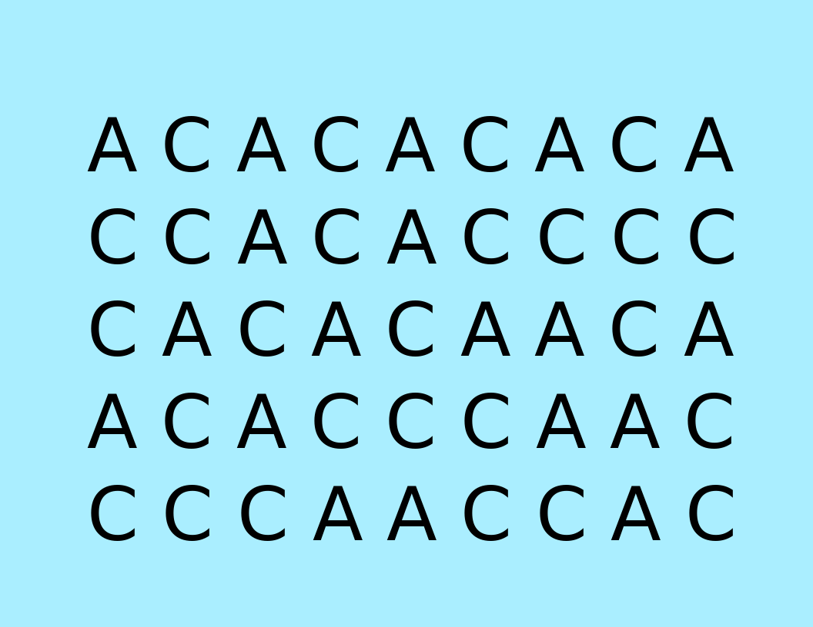</center>

$$p_1 = 26/45 \simeq 0.58$$

]

.pull-right[
#### <center> Population 2
<center>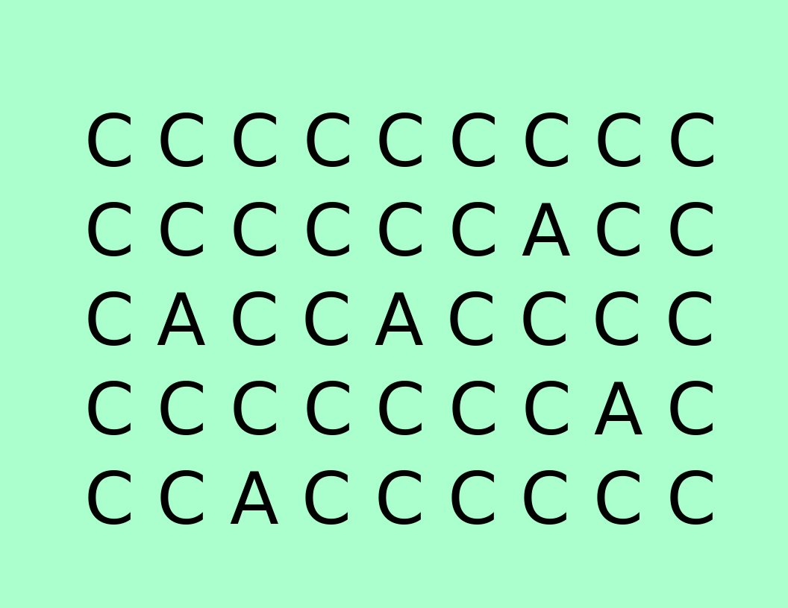</center>

$$p_2 = 40/45 \simeq 0.89$$

]

???

La statistique la plus utilisée pour quantifier le degré de différenciation entre deux populations pour un SNP donné, c'est l'indice de fixation.

Première façon de détecter de la différenciation, c'est de regarder la fréquence allélique au sein de chaque pop

Par exemple, si on s'intéresse à un locus particulier où on a les allèles A et C et qu'on regarde leur fréquence respective on peut avoir une idée de si un SNP est discriminant ou non.


---
<div id="rsn">
  <p>8/45</p>
</div>

### L'indice de fixation


#### Définition (Wright, 1943)

.pull-left[

$$F_{ST} = \frac{\frac{1}{N-1}\sum_{k = 1}^N (p_k - \bar{p})^2}{\bar{p}(1 - \bar{p})}$$
]

.pull-right[
$$\bar{p} = \frac{1}{N}\sum_{k = 1}^N p_k$$
]

--

#### Exemple de scan à $F_{ST}$ (Xu et al., 2010)

<center></center>

???

Il y a plusieurs définitions de l'indice de fixation, autrement appelé FST, et 
l'une d'entre elles est celle qui a été donnée par Wright, et qu'on utilisera
par la suite en guise de comparaison.

L'heuristique de cette statistique est très simple, si une des N populations affiche une fréquence très différente de la fréquence moyenne, alors il y a de grandes chances que ce SNP soit fortement associé avec la différenciation de cette population, relativement aux autres.


---
<div id="rsn">
  <p>8/45</p>
</div>

### L'indice de fixation


#### Définition (Wright, 1943)

.pull-left[

$$F_{ST} = \frac{\frac{1}{N-1}\sum_{k = 1}^N (p_k - \bar{p})^2}{\bar{p}(1 - \bar{p})}$$
]

.pull-right[
$$\bar{p} = \frac{1}{N}\sum_{k = 1}^N p_k$$
]


#### Test de Lewontin-Krakauer

$$T_{LK} = \frac{N-1}{\bar{F}_{ST}} F_{ST}$$

$T_{LK}$ suit une loi du $\chi^2$ à $N-1$ degrés de liberté

??? 

On n'a pas toujours un Manhattan plot aussi joli où des pics évidents ressortent


---
<div id="rsn">
  <p>9/45</p>
</div>

### Modèles démographiques

```{r}
circleFun <- function(center = c(0, 0),
                      diameter = 1,
                      npoints = 100,
                      start = 0,
                      end = 2,
                      filled = TRUE) {
  tt <- seq(start * pi, end * pi, length.out = npoints)
  df <- data.frame(
    x = center[1] + diameter / 2 * cos(tt),
    y = center[2] + diameter / 2 * sin(tt)
  )

  if (filled) { #add a point at the center so the whole 'pie slice' is filled
    df <- rbind(df, center)
  }

  return(df)
}

### Figure A
triangle.x <- c(0, 1, 2)
triangle.y <- c(0, sqrt(3), 0)
df.triangle <- data.frame(x = triangle.x, y = triangle.y)
df.branch <- data.frame(x1 = 0, x2 = 2, y1 = 0, y2 = 0)

diam <- 0.75
fullCircle.1 <- circleFun(c(0, 0), diam, start = 0, end = 2, filled = TRUE)
fullCircle.2 <- circleFun(c(1, sqrt(3)), diam, start = 0, end = 2, filled = TRUE)
fullCircle.3 <- circleFun(c(2, 0), diam, start = 0, end = 2, filled = TRUE)

p1 <- ggplot(df.triangle, aes(x = x, y = y)) +
  geom_line(size = 4, colour = "#E69F00") +
  geom_segment(data = df.branch,
               aes(x = x1, y = y1, xend = x2, yend = y2),
               size = 4,
               colour = "#E69F00") +
  geom_polygon(data = fullCircle.1, aes(x, y), color = "#56B4E9", fill = "#56B4E9") +
  geom_polygon(data = fullCircle.2, aes(x, y), color = "#56B4E9", fill = "#56B4E9") +
  geom_polygon(data = fullCircle.3, aes(x, y), color = "#56B4E9", fill = "#56B4E9") +
  coord_equal() +
  annotate("text",
           x = triangle.x,
           y = triangle.y,
           label = c("bold(P)[1]", "bold(P)[2]", "bold(P)[3]"),
           parse = TRUE, size = 5) +
  xlim(-1.5, 3.5) +
  ylim(-1.5, 2.5) +
  xlab("") +
  ylab("") +
  ggtitle("Modèle en îles", "") +
  theme_bw() +
  theme(axis.text = element_blank(),
        axis.ticks = element_blank(),
        plot.title = element_text(hjust = 0.5),
        plot.subtitle = element_text(hjust = 0.5),
        panel.grid.major = element_blank(),
        panel.grid.minor = element_blank(),
        panel.background = element_blank(),
        panel.border = element_blank())

### Figure B
triangle.x <- c(0.25, 1, 2)
triangle.y <- c(sqrt(3) / 4, sqrt(3), 0)
df.triangle <- data.frame(x = triangle.x, y = triangle.y)
df.branch <- data.frame(x1 = 1, x2 = 1, y1 = -1, y2 = sqrt(3))
fullCircle.4 <- circleFun(c(0.25, sqrt(3) / 4), diam, start = 0, end = 2, filled = TRUE)
fullCircle.5 <- circleFun(c(1, -1), diam, start = 0, end = 2, filled = TRUE)

p2 <- ggplot(df.triangle, aes(x = x, y = y)) +
  geom_line(size = 4, colour = "#E69F00") +
  geom_segment(data = df.branch,
               aes(x = x1, y = y1, xend = x2, yend = y2),
               size = 4,
               colour = "#E69F00") +
  geom_polygon(data = fullCircle.4, aes(x, y), color = "#56B4E9", fill = "#56B4E9") +
  geom_polygon(data = fullCircle.5, aes(x, y), color = "#56B4E9", fill = "#56B4E9") +
  geom_polygon(data = fullCircle.3, aes(x, y), color = "#56B4E9", fill = "#56B4E9") +
  coord_equal() +
  annotate("text",
           x = c(0.25, 1, 2),
           y = c(sqrt(3) / 4, -1, 0),
           label = c("bold(P)[1]", "bold(P)[2]", "bold(P)[3]"),
           parse = TRUE, size = 5) +
  xlim(-1.5, 3.5) +
  ylim(-1.5, 2.5) +
  xlab("") +
  ylab("") +
  ggtitle("Modèle en étoile", "(branches inégales)") +
  theme_bw() +
  theme(axis.text = element_blank(),
        axis.ticks = element_blank(),
        plot.title = element_text(hjust = 0.5),
        plot.subtitle = element_text(hjust = 0.5),
        panel.grid.major = element_blank(),
        panel.grid.minor = element_blank(),
        panel.background = element_blank(),
        panel.border = element_blank())

### Figure C
triangle.x <- c(0, 1, 2)
triangle.y <- c(0, sqrt(3), 0)
df.triangle <- data.frame(x = triangle.x, y = triangle.y)
df.branch <- data.frame(x1 = 1, x2 = 1, y1 = sqrt(3) - 2, y2 = sqrt(3))
fullCircle.6 <- circleFun(c(1, sqrt(3) - 2), diam, start = 0, end = 2, filled = TRUE)

p3 <- ggplot(df.triangle, aes(x = x, y = y)) +
  geom_line(size = 4, colour = "#E69F00") +
  geom_segment(data = df.branch,
               aes(x = x1, y = y1, xend = x2, yend = y2),
               size = 4,
               colour = "#E69F00") +
  geom_polygon(data = fullCircle.1, aes(x, y), color = "#56B4E9", fill = "#56B4E9") +
  geom_polygon(data = fullCircle.6, aes(x, y), color = "#56B4E9", fill = "#56B4E9") +
  geom_polygon(data = fullCircle.3, aes(x, y), color = "#56B4E9", fill = "#56B4E9") +
  coord_equal() +
  annotate("text",
           x = c(0, 1, 2),
           y = c(0, sqrt(3) - 2, 0),
           label = c("bold(P)[1]", "bold(P)[2]", "bold(P)[3]"),
           parse = TRUE, size = 5) +
  xlim(-1.5, 3.5) +
  ylim(-1.5, 2.5) +
  xlab("") +
  ylab("") +
  ggtitle("Modèle en étoile", "(branches égales)") +
  theme_bw() +
  theme(axis.text = element_blank(),
        axis.ticks = element_blank(),
        plot.title = element_text(hjust = 0.5),
        plot.subtitle = element_text(hjust = 0.5),
        panel.grid.major = element_blank(),
        panel.grid.minor = element_blank(),
        panel.background = element_blank(),
        panel.border = element_blank())

### Figure D
triangle.x <- c(0, 1, 2)
triangle.y <- c(0, sqrt(3), 0)
df.triangle <- data.frame(x = triangle.x, y = triangle.y)
df.branch <- data.frame(x1 = 1, x2 = 1.5, y1 = 0, y2 = sqrt(3) / 2)
fullCircle.6 <- circleFun(c(1, 0), diam, start = 0, end = 2, filled = TRUE)

p4 <- ggplot(df.triangle, aes(x = x, y = y)) +
  geom_line(size = 4, colour = "#E69F00") +
  geom_segment(data = df.branch,
               aes(x = x1, y = y1, xend = x2, yend = y2),
               size = 4,
               colour = "#E69F00") +
  geom_polygon(data = fullCircle.1, aes(x, y), color = "#56B4E9", fill = "#56B4E9") +
  geom_polygon(data = fullCircle.6, aes(x, y), color = "#56B4E9", fill = "#56B4E9") +
  geom_polygon(data = fullCircle.3, aes(x, y), color = "#56B4E9", fill = "#56B4E9") +
  coord_equal() +
  annotate("text",
           x = c(0, 1, 2),
           y = c(0, 0, 0),
           label = c("bold(P)[1]", "bold(P)[2]", "bold(P)[3]"),
           parse = TRUE, size = 5) +
  xlim(-1.5, 3.5) +
  ylim(-1.5, 2.5) +
  xlab("") +
  ylab("") +
  ggtitle("Modèle de divergence", "(structure hiérarchique)") +
  theme_bw() +
  theme(axis.text = element_blank(),
        axis.ticks = element_blank(),
        plot.title = element_text(hjust = 0.5),
        plot.subtitle = element_text(hjust = 0.5),
        panel.grid.major = element_blank(),
        panel.grid.minor = element_blank(),
        panel.background = element_blank(),
        panel.border = element_blank())


cowplot::plot_grid(p1, p2, p3, p4, labels = c("", "", "", ""), ncol = 2)
```


???

Qui dit génétique des populations dit modèle démographique. L'histoire démographique des populations a notamment un impact sur la façon dont évoluent les fréquences d'allèles.

Dans le cas d'un modèle en île que l'on a ici, le fait qu'il y ait des mouvements migratoires entre les populations va avoir tendance à maintenir la diversité allélique et limiter la différenciation, alors que si on n'a pas du tout de migration, les populations vont probablement se différencier plus rapidement.

Dans le cas d'un modèle de divergence, on a une population ancestrale qui va connaître un épisode de divergence et donc donner naissance à deux sous-populations, puis une des sous-populations va elle-même subir un autre épisode de divergence. Un peu à la manière de ce que l'on peut voir en phylogénie, les populations P2 et P3 ici vont être plus apparentées entre elles que par rapport à P1. 

---
<div id="rsn">
  <p>9/45</p>
</div>

### Modèles démographiques

```{r}
df.crossNWSE <- data.frame(x1 = -1.5, x2 = 3.5, y1 = 2.5, y2 = -1.5)
df.crossSWNE <- data.frame(x1 = -1.5, x2 = 3.5, y1 = -1.5, y2 = 2.5)

### Figure A
triangle.x <- c(0, 1, 2)
triangle.y <- c(0, sqrt(3), 0)
df.triangle <- data.frame(x = triangle.x, y = triangle.y)
df.branch <- data.frame(x1 = 0, x2 = 2, y1 = 0, y2 = 0)

diam <- 0.75
fullCircle.1 <- circleFun(c(0, 0), diam, start = 0, end = 2, filled = TRUE)
fullCircle.2 <- circleFun(c(1, sqrt(3)), diam, start = 0, end = 2, filled = TRUE)
fullCircle.3 <- circleFun(c(2, 0), diam, start = 0, end = 2, filled = TRUE)

p1 <- ggplot(df.triangle, aes(x = x, y = y)) +
  geom_line(size = 4, colour = "#E69F00") +
  geom_segment(data = df.branch,
               aes(x = x1, y = y1, xend = x2, yend = y2),
               size = 4,
               colour = "#E69F00") +
  geom_polygon(data = fullCircle.1, aes(x, y), color = "#56B4E9", fill = "#56B4E9") +
  geom_polygon(data = fullCircle.2, aes(x, y), color = "#56B4E9", fill = "#56B4E9") +
  geom_polygon(data = fullCircle.3, aes(x, y), color = "#56B4E9", fill = "#56B4E9") +
  coord_equal() +
  annotate("text",
           x = triangle.x,
           y = triangle.y,
           label = c("bold(P)[1]", "bold(P)[2]", "bold(P)[3]"),
           parse = TRUE, size = 5) +
  xlim(-1.5, 3.5) +
  ylim(-1.5, 2.5) +
  xlab("") +
  ylab("") +
  ggtitle("Modèle en îles", "") +
  theme_bw() +
  theme(axis.text = element_blank(),
        axis.ticks = element_blank(),
        plot.title = element_text(hjust = 0.5),
        plot.subtitle = element_text(hjust = 0.5),
        panel.grid.major = element_blank(),
        panel.grid.minor = element_blank(),
        panel.background = element_blank(),
        panel.border = element_blank())

### Figure B
triangle.x <- c(0.25, 1, 2)
triangle.y <- c(sqrt(3) / 4, sqrt(3), 0)
df.triangle <- data.frame(x = triangle.x, y = triangle.y)
df.branch <- data.frame(x1 = 1, x2 = 1, y1 = -1, y2 = sqrt(3))
fullCircle.4 <- circleFun(c(0.25, sqrt(3) / 4), diam, start = 0, end = 2, filled = TRUE)
fullCircle.5 <- circleFun(c(1, -1), diam, start = 0, end = 2, filled = TRUE)

p2 <- ggplot(df.triangle, aes(x = x, y = y)) +
  geom_line(size = 4, colour = "#E69F00") +
  geom_segment(data = df.branch,
               aes(x = x1, y = y1, xend = x2, yend = y2),
               size = 4,
               colour = "#E69F00") +
  geom_polygon(data = fullCircle.4, aes(x, y), color = "#56B4E9", fill = "#56B4E9") +
  geom_polygon(data = fullCircle.5, aes(x, y), color = "#56B4E9", fill = "#56B4E9") +
  geom_polygon(data = fullCircle.3, aes(x, y), color = "#56B4E9", fill = "#56B4E9") +
  coord_equal() +
  annotate("text",
           x = c(0.25, 1, 2),
           y = c(sqrt(3) / 4, -1, 0),
           label = c("bold(P)[1]", "bold(P)[2]", "bold(P)[3]"),
           parse = TRUE, size = 5) +
  geom_segment(data = df.crossNWSE,
               aes(x = x1, y = y1, xend = x2, yend = y2),
               size = 4,
               colour = "red") +
  geom_segment(data = df.crossSWNE,
               aes(x = x1, y = y1, xend = x2, yend = y2),
               size = 4,
               colour = "red") +
  xlim(-1.5, 3.5) +
  ylim(-1.5, 2.5) +
  xlab("") +
  ylab("") +
  ggtitle("Modèle en étoile", "(branches inégales)") +
  theme_bw() +
  theme(axis.text = element_blank(),
        axis.ticks = element_blank(),
        plot.title = element_text(hjust = 0.5),
        plot.subtitle = element_text(hjust = 0.5),
        panel.grid.major = element_blank(),
        panel.grid.minor = element_blank(),
        panel.background = element_blank(),
        panel.border = element_blank())

### Figure C
triangle.x <- c(0, 1, 2)
triangle.y <- c(0, sqrt(3), 0)
df.triangle <- data.frame(x = triangle.x, y = triangle.y)
df.branch <- data.frame(x1 = 1, x2 = 1, y1 = sqrt(3) - 2, y2 = sqrt(3))
fullCircle.6 <- circleFun(c(1, sqrt(3) - 2), diam, start = 0, end = 2, filled = TRUE)

p3 <- ggplot(df.triangle, aes(x = x, y = y)) +
  geom_line(size = 4, colour = "#E69F00") +
  geom_segment(data = df.branch,
               aes(x = x1, y = y1, xend = x2, yend = y2),
               size = 4,
               colour = "#E69F00") +
  geom_polygon(data = fullCircle.1, aes(x, y), color = "#56B4E9", fill = "#56B4E9") +
  geom_polygon(data = fullCircle.6, aes(x, y), color = "#56B4E9", fill = "#56B4E9") +
  geom_polygon(data = fullCircle.3, aes(x, y), color = "#56B4E9", fill = "#56B4E9") +
  coord_equal() +
  annotate("text",
           x = c(0, 1, 2),
           y = c(0, sqrt(3) - 2, 0),
           label = c("bold(P)[1]", "bold(P)[2]", "bold(P)[3]"),
           parse = TRUE, size = 5) +
  xlim(-1.5, 3.5) +
  ylim(-1.5, 2.5) +
  xlab("") +
  ylab("") +
  ggtitle("Modèle en étoile", "(branches égales)") +
  theme_bw() +
  theme(axis.text = element_blank(),
        axis.ticks = element_blank(),
        plot.title = element_text(hjust = 0.5),
        plot.subtitle = element_text(hjust = 0.5),
        panel.grid.major = element_blank(),
        panel.grid.minor = element_blank(),
        panel.background = element_blank(),
        panel.border = element_blank())

### Figure D
triangle.x <- c(0, 1, 2)
triangle.y <- c(0, sqrt(3), 0)
df.triangle <- data.frame(x = triangle.x, y = triangle.y)
df.branch <- data.frame(x1 = 1, x2 = 1.5, y1 = 0, y2 = sqrt(3) / 2)
fullCircle.6 <- circleFun(c(1, 0), diam, start = 0, end = 2, filled = TRUE)


p4 <- ggplot(df.triangle, aes(x = x, y = y)) +
  geom_line(size = 4, colour = "#E69F00") +
  geom_segment(data = df.branch,
               aes(x = x1, y = y1, xend = x2, yend = y2),
               size = 4,
               colour = "#E69F00") +
  geom_polygon(data = fullCircle.1, aes(x, y), color = "#56B4E9", fill = "#56B4E9") +
  geom_polygon(data = fullCircle.6, aes(x, y), color = "#56B4E9", fill = "#56B4E9") +
  geom_polygon(data = fullCircle.3, aes(x, y), color = "#56B4E9", fill = "#56B4E9") +
  coord_equal() +
  annotate("text",
           x = c(0, 1, 2),
           y = c(0, 0, 0),
           label = c("bold(P)[1]", "bold(P)[2]", "bold(P)[3]"),
           parse = TRUE, size = 5) +
  geom_segment(data = df.crossNWSE,
               aes(x = x1, y = y1, xend = x2, yend = y2),
               size = 4,
               colour = "red") +
  geom_segment(data = df.crossSWNE,
               aes(x = x1, y = y1, xend = x2, yend = y2),
               size = 4,
               colour = "red") +
  xlim(-1.5, 3.5) +
  ylim(-1.5, 2.5) +
  xlab("") +
  ylab("") +
  ggtitle("Modèle de divergence", "(structure hiérarchique)") +
  theme_bw() +
  theme(axis.text = element_blank(),
        axis.ticks = element_blank(),
        plot.title = element_text(hjust = 0.5),
        plot.subtitle = element_text(hjust = 0.5),
        panel.grid.major = element_blank(),
        panel.grid.minor = element_blank(),
        panel.background = element_blank(),
        panel.border = element_blank())


cowplot::plot_grid(p1, p2, p3, p4, labels = c("", "", "", ""), ncol = 2)
```


---
background-image: url("figure/pca_ex.png")
background-size: cover
class: bottom coupure

<h1 style="text-shadow: 2px 0 0 black, -2px 0 0 black, 0 2px 0 black, 0 -2px 0 black, 1px 1px black, -1px -1px 0 black, 1px -1px 0 black, -1px 1px 0 black;"> L'Analyse en Composantes Principales (ACP)</h1>

<div id="rsn">
  <p>10/45</p>
</div>


---
<div id="rsn">
  <p>11/45</p>
</div>

### L'ACP en génétique des populations

.pull-left[

- Normalisation de la matrice de génotypes

$$\tilde{G}_{.,j} = \frac{G_{.,j} - 2 p_j}{\sqrt{2p_j(1-p_j)}}$$

- Calcul de la matrice d'apparentement génétique

$$G_{RM} = \frac{1}{p}\tilde{G} \tilde{G}^T$$


- Diagonalisation de $G_{RM}$


$$G_{RM} = U \Sigma^2 U^T$$

où $\Sigma \in M_n(\mathbb{R})$ et $U \in M_n(\mathbb{R})$.  
]

.pull-right[

```{r, echo = TRUE, eval = FALSE}
p<-apply(G,MARGIN=2,mean)/2  
s<-sqrt(2*p*(1-p))
G.tilde<-scale(G, 
               center=T, 
               scale=s)
```


]


---
<div id="rsn">
  <p>11/45</p>
</div>

### L'ACP en génétique des populations

.pull-left[

- Normalisation de la matrice de génotypes

$$\tilde{G}_{.,j} = \frac{G_{.,j} - 2 p_j}{\sqrt{2p_j(1-p_j)}}$$

- Calcul de la matrice d'apparentement génétique

$$G_{RM} = \frac{1}{p}\tilde{G} \tilde{G}^T$$


- Diagonalisation de $G_{RM}$


$$G_{RM} = U \Sigma^2 U^T$$

où $\Sigma \in M_n(\mathbb{R})$ et $U \in M_n(\mathbb{R})$.  
]

.pull-right[

<br>

```{r, fig.height = 8}
G <- readRDS("data/isl.rds")
pop <- G$pop
pop <- pop[seq(1, ncol(G$geno), by = 5)]
G <- G$geno[, seq(1, ncol(G$geno), by = 5)]
p <- apply(G, MARGIN = 1, FUN = function(h) {mean(h) / 2})
G <- G[p > 0, ]
p <- p[p > 0]
Gn <- scale(t(G), center = TRUE, scale = sqrt(2 * p * (1 - p)))
GRM <- cor(t(Gn))
corrplot::corrplot(GRM, method = "color", tl.pos = "n")
```


]


---
<div id="rsn">
  <p>11/45</p>
</div>

### L'ACP en génétique des populations

.pull-left[

- Normalisation de la matrice de génotypes

$$\tilde{G}_{.,j} = \frac{G_{.,j} - 2 p_j}{\sqrt{2p_j(1-p_j)}}$$

- Calcul de la matrice d'apparentement génétique

$$G_{RM} = \frac{1}{p}\tilde{G} \tilde{G}^T$$


- Diagonalisation de $G_{RM}$


$$G_{RM} = U \Sigma^2 U^T$$

où $\Sigma \in M_n(\mathbb{R})$ et $U \in M_n(\mathbb{R})$.  
]

.pull-right[

<br>

```{r, include = FALSE}
obj.isl <- pcadapt::pcadapt(G, K = 2)
```

```{r, fig.height = 8}
ggdf <- data.frame(PC1 = obj.isl$scores[, 1],
                   PC2 = obj.isl$scores[, 2])

ggplot(ggdf, aes(x = PC1, y = PC2)) +
  geom_point(size = 7.5, shape = 21, stroke = 1, fill = "steelblue") +
  coord_equal() +
  theme_bw() +
  theme(axis.text = element_text(face = "bold"),
        text = element_text(size = 25),
        legend.position = "none")
```

]


---
<div id="rsn">
  <p>11/45</p>
</div>

### L'ACP en génétique des populations

.pull-left[

- Normalisation de la matrice de génotypes

$$\tilde{G}_{.,j} = \frac{G_{.,j} - 2 p_j}{\sqrt{2p_j(1-p_j)}}$$

- Calcul de la matrice d'apparentement génétique

$$G_{RM} = \frac{1}{p}\tilde{G} \tilde{G}^T$$


- Décomposition en valeurs singulières de $\tilde{G}$


$$\tilde{G} \simeq U \Sigma V^T$$

où $\Sigma \in M_K(\mathbb{R})$, $U \in M_{nK}(\mathbb{R})$, $V \in M_{pK}(\mathbb{R})$ avec $K < n$.  

]

.pull-right[

<br>

```{r, include = FALSE}
obj.isl <- pcadapt::pcadapt(G, K = 2)
```

```{r, fig.height = 8}
ggdf <- data.frame(PC1 = obj.isl$scores[, 1],
                   PC2 = obj.isl$scores[, 2])

ggplot(ggdf, aes(x = PC1, y = PC2)) +
  geom_point(size = 7.5, shape = 21, stroke = 1, fill = "steelblue") +
  coord_equal() +
  theme_bw() +
  theme(axis.text = element_text(face = "bold"),
        text = element_text(size = 25),
        legend.position = "none")
```


]


---
<div id="rsn">
  <p>11/45</p>
</div>

### L'ACP en génétique des populations

.pull-left[

- Normalisation de la matrice de génotypes

$$\tilde{G}_{.,j} = \frac{G_{.,j} - 2 p_j}{\sqrt{2p_j(1-p_j)}}$$

- Calcul de la matrice d'apparentement génétique

$$G_{RM} = \frac{1}{p}\tilde{G} \tilde{G}^T$$


- Décomposition en valeurs singulières de $\tilde{G}$


$$\tilde{G} \simeq U \Sigma V^T$$

où $\Sigma \in M_K(\mathbb{R})$, $U \in M_{nK}(\mathbb{R})$, $V \in M_{pK}(\mathbb{R})$ avec $K < n$.  

]

.pull-right[

<br>

```{r, include = FALSE}
obj.isl <- pcadapt::pcadapt(G, K = 2)
```

```{r, include = FALSE}
K <- 15
x.I <- readRDS("data/isl.rds")
x.D <- readRDS("data/div.rds")

res.I <- pcadapt(x.I$geno, K = K)
res.D <- pcadapt(x.D$geno, K = K)

model <- c(rep("isl", K), rep("div", K))
df <- data.frame(model = model,
                 x = c(1:K, 1:K),
                 values = c(res.I$singular.values^2 / length(res.I$maf),
                            res.D$singular.values^2 / length(res.D$maf)))
```


```{r}
df %>%
  filter(model == "isl") %>%
  ggplot(aes(x = x, y = values)) +
  geom_line(color = cbbPalette[3], size = 3) +
  geom_point(color = cbbPalette[6], size = 5) +
  xlab("PC") +
  ylab("Proportion de variance expliquée") +
  annotate("text",
           x = 6,
           y = df$values[df$model == "isl"][2],
           label = "K = 2",
           size = 15,
           fontface = "italic",
           colour = "black") +
  geom_segment(aes(x = 4,
                   y = df$values[df$model == "isl"][2],
                   xend = 2,
                   yend = df$values[df$model == "isl"][2]),
               colour = "black",
               size = 1,
               arrow = arrow(length = unit(8, "pt"),
                             type = "closed")) +
  theme_bw(base_size = 20) +
  theme(plot.title = element_text(hjust = 0.5),
        axis.title = element_text(size = 20, face = "bold")) 

```

]


---
<div id="rsn">
  <p>12/45</p>
</div>

### POPRES (Novembre et al., 2008)

```{r}
obj.popres <- readRDS("data/popres.rds")
```

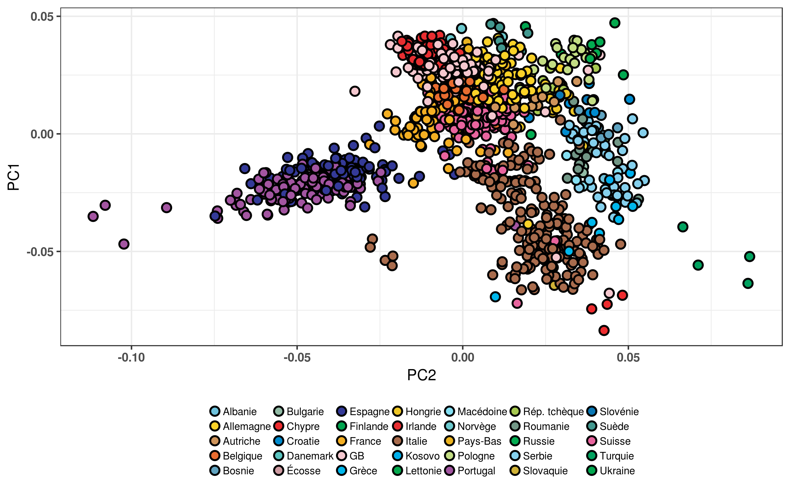

???

Structure de populations continue

Reflète la structure géographique


---
<div id="rsn">
  <p>13/45</p>
</div>

<br>

<br>

.pull-left[

]


.pull-right[

<br>

- L'information contenue dans les génotypes permet de regrouper les individus dans
des clusters de façon non supervisée.

- Ces clusters correspondent aux populations auxquelles ces individus appartiennent. 

- Comment cela peut-il nous permettre de détecter des locus sous sélection `r emojifont::emoji('question')`


]


---
class: bottom, coupure

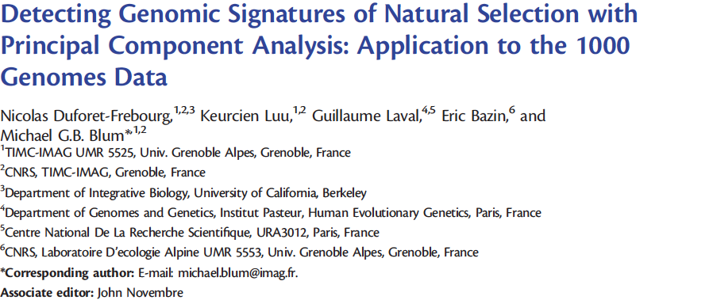

# Une première statistique de test

<div id="rsn">
  <p>14/45</p>
</div>

---
<div id="rsn">
  <p>15/45</p>
</div>

### La communalité

.pull-left[

- Décomposition en valeurs singulières de $\tilde{G}$

$$\tilde{G} \simeq U \Sigma V^T$$

- Corrélation du $i$-ème SNP au $k$-ème axe principal

$$\rho_{ik} = \frac{\sqrt{\lambda_{k}} V_{ik}}{\sqrt{n - 1}}$$

- Définition pour le $i$-ème SNP

\begin{align}
h_i^2 &= \sum_{k=1}^K \rho_{ik}^2 = \frac{1}{n-1} \sum_{k=1}^K \lambda_k V_{ik}^2 \\
&\simeq ||\tilde{G}_{.,i}^T U||_2^2
\end{align}


]


.pull-right[

#### <center> Matrice des loadings
$$V = \begin{pmatrix}
V_{11} & V_{12} & V_{13} \\
V_{21} & V_{22} & V_{23} \\
V_{31} & V_{32} & V_{33} \\
V_{41} & V_{42} & V_{43} \\
\vdots & \vdots & \vdots
\end{pmatrix}$$

#### <center> Variances
$$\Sigma^2 = \begin{pmatrix}
\lambda_1 & 0 & 0 \\
0 & \lambda_2 & 0 \\
0 & 0 & \lambda_3
\end{pmatrix}$$
]

???

- Reprendre la décomposition précédente


---
<div id="rsn">
  <p>16/45</p>
</div>

### POPRES

```{r}
d <- obj.popres$d
stat <- (d[1]^2 * obj.popres$v[, 1]^2 + d[2]^2 * obj.popres$v[, 2]^2) / (nrow(obj.popres$u) - 1)
n.keep <- floor(nrow(obj.popres$v) / 10)
chr.odd.even <- obj.popres$chr %% 2

s <- sort(stat, index.return = TRUE, decreasing = TRUE)$ix[1:n.keep]
idx <- s[1:101]
chr.odd.even[idx] <- 2
chr.odd.even <- chr.odd.even[sort(s)]

df <- data.frame(position = 1:n.keep,
                 stat = stat[sort(s)], 
                 chr = chr.odd.even)

df %>% 
  ggplot(aes(x = position, y = stat, color = as.factor(chr))) +
  geom_point() +
  scale_color_manual(values = c("grey", "black", "red")) +
  guides(colour = FALSE) +
  ylab("Communalité") +
  annotate("text",
           x = c(5558, 16920, 35642),
           y = c(0.27, 0.1, 0.1),
           label = c("LCT", "HLA", "HERC2"),
           size = 3,
           colour = "black") +
  theme_bw() +
  theme(axis.title.x = element_blank(),
        axis.text.x = element_blank(),
        axis.ticks.x = element_blank())
```

???
Manhattan plot

Signaux d'adaptation biologique connus 

Décrire LCT, HLA, HERC2


---
<div id="rsn">
  <p>17/45</p>
</div>

### Lien avec l'indice de fixation

```{r, include = FALSE}
G <- readRDS("data/isl.rds")
locusNames <- as.character(1:nrow(G$geno))
popNames <- as.character(G$pop)
FSTMat <- OutFLANK::MakeDiploidFSTMat(t(G$geno), locusNames, popNames)

idx <- which(FSTMat$FST < 0.2)
locusNames <- locusNames[idx]
geno <- G$geno[idx, ]

FSTMat <- OutFLANK::MakeDiploidFSTMat(t(geno), locusNames, popNames)
x <- pcadapt::pcadapt(geno, K = 2, method = "communality")
```

.pull-left[
```{r, fig.height = 8}
ggdf <- data.frame(PC1 = x$scores[, 1],
                   PC2 = x$scores[, 2],
                   pop = as.factor(popNames))

ggplot(ggdf, aes(x = PC1, y = PC2, fill = pop)) +
  geom_point(size = 7.5, shape = 21, stroke = 1) +
  scale_fill_manual(labels = sort(unique(ggdf$pop)),
                    values = as.character(obj.popres$palette.fr[c(1, 2, 4)])) +
  coord_equal() +
  theme_bw() +
  theme(axis.text = element_text(face = "bold"),
        text = element_text(size = 25),
        legend.position = "none")
```
]

.pull-right[

```{r, fig.height = 8}
data.frame(x = FSTMat$FST, y = x$stat) %>%
  ggplot(aes(x = x, y = y)) +
  geom_point(color = "#2e7b77") +
  geom_smooth(method = 'lm',formula = y~x, color = "red", se = FALSE) +
  annotate("text", x = 0.075, y = 2, label = paste("Coefficient de corrélation : ", format(cor(x$stat, FSTMat$FST), digits = 3)), size = 10) +
  xlab(expression(F[ST])) +
  ylab("Communalité") +
  theme_bw() +
  theme(text = element_text(size = 25),
        legend.position = "none")
```
]

\begin{align}
F_{ST} = \frac{\frac{1}{N-1}\sum_{k = 1}^N (p_{ki} - \bar{p_i})^2}{\bar{p_i}(1 - \bar{p_i})}
\end{align}


---
<div id="rsn">
  <p>17/45</p>
</div>

### Lien avec l'indice de fixation

.pull-left[

```{r, fig.height = 8}
ggdf <- data.frame(PC1 = x$scores[, 1],
                   PC2 = x$scores[, 2],
                   pop = as.factor(popNames))

ggplot(ggdf, aes(x = PC1, y = PC2, fill = pop)) +
  geom_point(size = 7.5, shape = 21, stroke = 1) +
  scale_fill_manual(labels = sort(unique(ggdf$pop)),
                    values = as.character(obj.popres$palette.fr[c(1, 2, 4)])) +
  coord_equal() +
  theme_bw() +
  theme(axis.text = element_text(face = "bold"),
        text = element_text(size = 25),
        legend.position = "none")
```

]


.pull-right[ 

$$U_{\delta} = \begin{pmatrix} 
\color{#6ec2dc}{\frac{1}{N_1\sqrt{2(N-1)}}} & 0 & 0 \\
\color{#6ec2dc}{\frac{1}{N_1\sqrt{2(N-1)}}} & 0 & 0 \\
\vdots & \vdots & \vdots \\
0 & \color{#fbd228}{\frac{1}{N_2\sqrt{2(N-1)}}} & 0 \\
0 & \color{#fbd228}{\frac{1}{N_2\sqrt{2(N-1)}}} & 0 \\
\vdots & \vdots & \vdots \\
0 & 0 & \color{#e86c30}{\frac{1}{N_3\sqrt{2(N-1)}}} \\
0 & 0 & \color{#e86c30}{\frac{1}{N_3\sqrt{2(N-1)}}} 
\end{pmatrix}$$

]


\begin{align}
F_{ST} = \frac{\frac{1}{N-1}\sum_{k = 1}^N (p_{ki} - \bar{p_i})^2}{\bar{p_i}(1 - \bar{p_i})}
\end{align}

---
<div id="rsn">
  <p>17/45</p>
</div>

### Lien avec l'indice de fixation

.pull-left[

```{r, fig.height = 8}
ggdf <- data.frame(PC1 = x$scores[, 1],
                   PC2 = x$scores[, 2],
                   pop = as.factor(popNames))

ggplot(ggdf, aes(x = PC1, y = PC2, fill = pop)) +
  geom_point(size = 7.5, shape = 21, stroke = 1) +
  scale_fill_manual(labels = sort(unique(ggdf$pop)),
                    values = as.character(obj.popres$palette.fr[c(1, 2, 4)])) +
  coord_equal() +
  theme_bw() +
  theme(axis.text = element_text(face = "bold"),
        text = element_text(size = 25),
        legend.position = "none")
```

]


.pull-right[ 

$$U_{\delta} = \begin{pmatrix} 
\color{#6ec2dc}{\frac{1}{N_1\sqrt{2(N-1)}}} & 0 & 0 \\
\color{#6ec2dc}{\frac{1}{N_1\sqrt{2(N-1)}}} & 0 & 0 \\
\vdots & \vdots & \vdots \\
0 & \color{#fbd228}{\frac{1}{N_2\sqrt{2(N-1)}}} & 0 \\
0 & \color{#fbd228}{\frac{1}{N_2\sqrt{2(N-1)}}} & 0 \\
\vdots & \vdots & \vdots \\
0 & 0 & \color{#e86c30}{\frac{1}{N_3\sqrt{2(N-1)}}} \\
0 & 0 & \color{#e86c30}{\frac{1}{N_3\sqrt{2(N-1)}}} 
\end{pmatrix}$$

]

\begin{align}
F_{ST} &= \frac{\frac{1}{N-1}\sum_{k = 1}^N (p_{ki} - \bar{p_i})^2}{\bar{p_i}(1 - \bar{p_i})} \\
&= ||\tilde{G}_{.,i}^T U_{\delta}||_2^2
\end{align}


---
<div id="rsn">
  <p>18/45</p>
</div>

### Lien avec l'indice de fixation

.pull-left[

#### Indice de fixation

- $F_{ST} = ||\tilde{G}_{.,i}^T U_{\delta}||_2^2$

- Scores discrets

- Information populationnelle nécessaire
]

.pull-right[

#### Communalité

- $h_i^2 \simeq ||\tilde{G}_{.,i}^T U||_2^2$

- Scores continus

- Information populationnelle non requise
]


???

Généralisation de l'indice de fixation au cas de populations continues.


---
<div id="rsn">
  <p>19/45</p>
</div>

### Limites

- Nombre de SNPs : 4542

- Nombre d'individus : 517

- Nombre de SNPs sous sélection : 12

--

```{r, include = FALSE}
case2 <- readRDS("data/Case2.rds")
x <- pcadapt::pcadapt(case2$geno, K = 3, method = "communality", min.maf = 0)
noo <- rep("Neutre", nrow(case2$geno))
noo[case2$ground.truth] <- "Sous sélection"

popNames <- as.character(case2$pop)
locusNames <- as.character(1:nrow(case2$geno))
FSTMat <- OutFLANK::MakeDiploidFSTMat(t(case2$geno), locusNames, popNames)

```

.pull-left[
```{r}

df <- data.frame(x = 1:nrow(case2$geno), 
                 y = FSTMat$FST, 
                 z = noo)


df %>%
  ggplot(aes(x = x, y = y)) +
  geom_point(color = "#2e7b77", size = 2) +
  xlab("SNP") + 
  ylab(expression(F[ST])) +
  theme_bw() +
  theme(axis.text = element_text(face = "bold"),
        text = element_text(size = 25),
        legend.position = "none")
```
]


.pull-right[
```{r}
df <- data.frame(x = 1:nrow(case2$geno), 
                 y = x$stat, 
                 z = noo)

df %>%
  ggplot(aes(x = x, y = y)) +
  geom_point(color = "#2e7b77", size = 2) +
  xlab("SNP") + 
  ylab("Communalité") +
  theme_bw() +
  theme(axis.text = element_text(face = "bold"),
        text = element_text(size = 25),
        legend.position = "none")
```
]


---
<div id="rsn">
  <p>19/45</p>
</div>

### Limites

- Nombre de SNPs : 4542

- Nombre d'individus : 517

- Nombre de SNPs sous sélection : 12


.pull-left[

```{r}

df <- data.frame(x = 1:nrow(case2$geno), 
                 y = FSTMat$FST, 
                 z = noo)


df %>%
  ggplot(aes(x = x, y = y, color = z, size = z)) +
  geom_point() + 
  scale_color_manual(values = c("#2e7b77", "red")) +
  scale_size_manual(values = c(2, 5)) +
  xlab("SNP") + 
  ylab(expression(F[ST])) +
  theme_bw() +
  theme(axis.text = element_text(face = "bold"),
        text = element_text(size = 25),
        legend.position = "none")
```
]


.pull-right[
```{r}
df <- data.frame(x = 1:nrow(case2$geno), 
                 y = x$stat, 
                 z = noo)

df %>%
  ggplot(aes(x = x, y = y, color = z, size = z)) +
  geom_point() + 
  scale_color_manual(values = c("#2e7b77", "red")) +
  scale_size_manual(values = c(2, 5)) +
  xlab("SNP") + 
  ylab("Communalité") +
  theme_bw() +
  theme(axis.text = element_text(face = "bold"),
        text = element_text(size = 25),
        legend.position = "none")
```
]

---
class: bottom, coupure


# Une nouvelle statistique de test

<div id="rsn">
  <p>20/45</p>
</div>


---
<div id="rsn">
  <p>21/45</p>
</div>

### Méthode

- Décomposition en valeurs singulières 

$$\tilde{G} = U \Sigma V^T$$

--

- Régression linéaire multiple 

$$\tilde{G}_{.,i} = \sum_{k=1}^K \beta_{ik}U_k + \epsilon_i$$

--

- Coefficients de régression standardisés

$$z_{i} = \frac{U^T\tilde{G}_{.,i}}{\sqrt{\frac{||\epsilon_i||_2^2}{n - K - 1}}}$$

--

- Distance de Mahalanobis

$$D_i^2 = (z_i - \bar{z})^T S^{-1} (z_i - \bar{z})$$

où $S$ est un estimateur de $\left(\text{cov}(z_i, z_j)\right)_{1 \leq i,j \leq p}$

---
<div id="rsn">
  <p>21/45</p>
</div>

### Méthode

- Décomposition en valeurs singulières 

$$\tilde{G} = U \Sigma V^T$$

- Régression linéaire multiple 

$$\tilde{G}_{.,i} = \sum_{k=1}^K \beta_{ik}U_k + \epsilon_i$$

- Coefficients de régression standardisés

$$z_{i} = \frac{U^T\tilde{G}_{.,i}}{\sqrt{\frac{||\epsilon_i||_2^2}{n - K - 1}}}$$

- Distance **robuste** de Mahalanobis

$$D_i^2 = (z_i - \bar{z})^T S^{-1} (z_i - \bar{z})$$

où $S$ est un estimateur **robuste** de $\left(\text{cov}(z_i, z_j)\right)_{1 \leq i,j \leq p}$

???

Another important unsupervised task is anomaly detection - for example, detecting unusual
credit card transactions to prevent fraud, catching manufacturing defects, or automatically
removing outliers from a dataset before feeding it to another learning algorithm. The system
is trained with normal instances, and when it sees a new instance it can tell whether it looks
like a normal one or whether it is likely an anomaly. Hands-On Machine Learning with Scikit-Learn & TensorFlow


---
<div id="rsn">
  <p>22/45</p>
</div>

### Classique VS Robuste

```{r, include = FALSE}
dt <- readRDS("data/div.rds")
x <- pcadapt(dt$geno, K = 2)
gt <- dt$ground.truth
confidence <- 0.95

df.data <- data.frame(x.coord = x$zscores[-gt, 1],
                      y.coord = x$zscores[-gt, 2],
                      method = "Locus neutre")
df.out <- data.frame(x.coord = x$zscores[gt, 1],
                     y.coord = x$zscores[gt, 2],
                     method = "Locus sous sélection")

get.ellipse.coord = function(x, method = NULL, ci = confidence, n.pts = 500){
  ep <- eigen(x$cov, symmetric = TRUE)
  s <- qchisq(ci, df = length(x$center))
  a <- 2 * sqrt(s * ep$values[1])
  b <- 2 * sqrt(s * ep$values[2])
  alpha <- atan(ep$vectors[2, 1] / ep$vectors[1, 1])
  t <- seq(0, 2 * pi, length.out = n.pts)
  x.coord <- a * cos(t)
  y.coord <- b * sin(t)
  coord <- as.matrix(rbind(x.coord, y.coord))
  R_alpha <- matrix(0, 2, 2)
  R_alpha[1, 1] <- cos(alpha)
  R_alpha[2, 2] <- cos(alpha)
  R_alpha[1, 2] <- -sin(alpha)
  R_alpha[2, 1] <- sin(alpha)
  new.coord <- R_alpha %*% coord
  df <- data.frame(x.coord = new.coord[1, ],
                   y.coord = new.coord[2, ],
                   method = method)
  return(df)
}

obj.true <- list(cov = cov(x$zscores),
                 center = apply(x$zscores, MARGIN = 2, FUN = mean))

tmp <- pcadapt::covRob_cpp(x$zscores)
obj.ogk <- list(cov = tmp$cov,
                center = tmp$center)

tmp <- robust::covRob(x$zscores)
obj.mcd <- list(cov = tmp$cov,
                center = tmp$center)

df.1 <- get.ellipse.coord(obj.true, "Classique")
df.2 <- get.ellipse.coord(obj.ogk, "OGK (Robuste)")
df.3 <- get.ellipse.coord(obj.mcd, "MCD (Robuste)")

df.div <- rbind(df.data, df.out, df.1, df.2, df.3)
df.div$model <- "Modèle de divergence"

dt <- readRDS("data/isl.rds")
x <- pcadapt(dt$geno, K = 2)
gt <- dt$ground.truth

df.data <- data.frame(x.coord = x$zscores[-gt, 1],
                      y.coord = x$zscores[-gt, 2],
                      method = "Locus neutre")
df.out <- data.frame(x.coord = x$zscores[gt, 1],
                     y.coord = x$zscores[gt, 2],
                     method = "Locus sous sélection")

obj.true <- list(cov = cov(x$zscores),
                 center = apply(x$zscores, MARGIN = 2, FUN = mean))

tmp <- pcadapt::covRob_cpp(x$zscores)
obj.ogk <- list(cov = tmp$cov,
                center = tmp$center)

tmp <- robust::covRob(x$zscores)
obj.mcd <- list(cov = tmp$cov,
                center = tmp$center)

df.1 <- get.ellipse.coord(obj.true, "Classique")
df.2 <- get.ellipse.coord(obj.ogk, "OGK (Robuste)")
df.3 <- get.ellipse.coord(obj.mcd, "MCD (Robuste)")
df.isl <- rbind(df.data, df.out, df.1, df.2, df.3)
df.isl$model <- "Modèle en îles"
```


```{r}
rbind(df.div, df.isl) %>%
ggplot(aes(x = x.coord, y = y.coord)) +
  geom_point(aes(color = method), size = 0.5, na.rm = TRUE) +
  scale_color_manual(values = c("#56B4E9", "#D55E00", "#009E73", "#E69F00", "#CC79A7")) +
  facet_grid(~model, scales = "free") +
  guides(colour = guide_legend(override.aes = list(size = c(2, 2, 5, 5, 5),
                                                   shape = c(16, 16, 1, 1, 1)), ncol = 1)) +
  coord_fixed() +
  xlab("z-scores PC1") +
  ylab("z-scores PC2") +
  ylim(-50, 50) +
  theme_bw() +
  theme(axis.text = element_text(size = 15),
        axis.title = element_text(size = 15, face = "bold"),
        strip.text = element_text(size = 15, face = "bold"),
        title = element_text(size = 15, face = "bold"),
        legend.text = element_text(size = 15),
        legend.title = element_blank(),
        legend.key.height = unit(1, "line"),
        legend.key.width = unit(3, "line"),
        legend.position = c(0.175, 0.85),
        legend.background = element_rect(fill = alpha("white", 0)),
        legend.key = element_rect(fill = alpha("white", 0)),
        axis.title.x = element_text(margin = margin(t = 20, r = 0, b = 0, l = 0)),
        axis.title.y = element_text(margin = margin(t = 0, r = 20, b = 0, l = 0)))
```

---
<div id="rsn">
  <p>23/45</p>
</div>

### Communalité VS Mahalanobis

- Nombre de SNPs : 4542

- Nombre d'individus : 517

- Nombre de SNPs sous sélection : 12

```{r, include = FALSE}
case2 <- readRDS("data/Case2.rds")
x <- pcadapt::pcadapt(case2$geno, K = 3, method = "communality", min.maf = 0)
y <- pcadapt::pcadapt(case2$geno, K = 3, min.maf = 0)
```

--

.pull-left[
```{r}
df <- data.frame(x = 1:nrow(case2$geno), 
                 y = x$stat, 
                 z = noo)

df %>%
  ggplot(aes(x = x, y = y, color = z, size = z)) +
  geom_point() + 
  scale_color_manual(values = c("#2e7b77", "red")) +
  scale_size_manual(values = c(2, 5)) +
  xlab("SNP") +
  ylab("Communalité") +
  theme_bw() +
  theme(axis.text = element_text(face = "bold"),
        text = element_text(size = 25),
        legend.position = "none")
```
]


.pull-right[
```{r}
df <- data.frame(x = 1:nrow(case2$geno), 
                 y = y$stat, 
                 z = noo)

df %>%
  ggplot(aes(x = x, y = y, color = z, size = z)) +
  geom_point() + 
  scale_color_manual(values = c("#2e7b77", "red")) +
  scale_size_manual(values = c(2, 5)) +
  xlab("SNP") +
  ylab("Dist. rob. de Mahalanobis") +
  theme_bw() +
  theme(axis.text = element_text(face = "bold"),
        text = element_text(size = 25),
        legend.position = "none")
```
]

---
<div id="rsn">
  <p>24/45</p>
</div>

### `pcadapt` VS `pcadapt`

```{r}
hc.df <- data.frame(power = c(0.291, 0.319, 0.316,
                              0.02, 0.04, 0.2,
                              0.13, 0.34, 0.46),
                    model = factor(c(rep("Modèle en îles", 3),
                                     rep("Modèle de divergence", 3),
                                     rep("Modèle d'expansion", 3)),
                                   levels = c("Modèle en îles", 
                                              "Modèle de divergence", 
                                              "Modèle d'expansion")),
                    method = rep(c("Facteurs de Bayes", 
                                   "Communalité", 
                                   "Mahalanobis"), 3))

colnames(hc.df) <- c("Puissance", "Modèle", "Méthode")

thm <- hc_theme(
  colors = c("darkturquoise", "darkcyan", "darkslategrey"),
  chart = list(
    backgroundColor = NULL
    )
)

highcharter::hchart(hc.df, 
                    "column", 
                    hcaes(x = "Modèle", y = "Puissance", group = "Méthode")) %>%
  hc_add_theme(thm)
```


---
<div id="rsn">
  <p>25/45</p>
</div>

### `pcadapt` & Cie

.pull-left[
```{r}
hc.df <- readRDS("data/isldivrexp.rds") %>%
  filter(model == "div", software != "SNMF") %>%
  mutate(model = NULL)

colnames(hc.df) <- c("Logiciel", "Puissance", "Type")

type.fr <- as.character(hc.df$Type)
type.fr[type.fr == "No admixture"] <- "Sans métissage"
type.fr[type.fr == "With admixture"] <- "Avec métissage"
hc.df$Type <- as.factor(type.fr)

thm <- hc_theme(
  colors = c("#56B4E9", "#0072B2"),
  chart = list(
    backgroundColor = NULL
    )
)

highcharter::hchart(hc.df, 
                    "column", 
                    hcaes(x = Logiciel, y = Puissance, group = Type)) %>%
  hc_add_theme(thm) %>%
  hc_title(text = "Modèle de divergence")
  
```
]


.pull-right[
```{r}
hc.df <- readRDS("data/isldivrexp.rds") %>%
  filter(model == "isl", software != "SNMF") %>%
  mutate(model = NULL)

colnames(hc.df) <- c("Logiciel", "Puissance", "Type")

type.fr <- as.character(hc.df$Type)
type.fr[type.fr == "No admixture"] <- "Sans métissage"
type.fr[type.fr == "With admixture"] <- "Avec métissage"
hc.df$Type <- as.factor(type.fr)

thm <- hc_theme(
  colors = c("#56B4E9", "#0072B2"),
  chart = list(
    backgroundColor = NULL
    )
)

highcharter::hchart(hc.df, 
                    "column", 
                    hcaes(x = Logiciel, y = Puissance, group = Type)) %>%
  hc_add_theme(thm) %>%
  hc_title(text = "Modèle en îles")
  
```
]


---
<div id="rsn">
  <p>26/45</p>
</div>

### `pcadapt` & Cie

.pull-left[
```{r}
df <- readRDS("data/curves-fdrpower.rds") %>%
  mutate(Puissance = power, Logiciel = software, FDR = fdr) %>%
  filter(model %in% c("isl", "islh"), software != "SNMF") %>%
  droplevels()
levels(df$model) <- c("Sans métissage", "Avec métissage")

thm <- hc_theme(
  colors = cbbPalette[c(7, 2, 4, 3)],
  chart = list(
    backgroundColor = NULL
    )
)


df %>% 
  filter(model == "Sans métissage") %>%
  hchart("line", hcaes(x = FDR, y = Puissance, group = Logiciel)) %>%
  hc_add_theme(thm) %>%
  hc_title(text = "Sans métissage")
```
]


.pull-right[
```{r}
df %>% 
  filter(model == "Avec métissage") %>%
  hchart("line", hcaes(x = FDR, y = Puissance, group = Logiciel)) %>%
  hc_add_theme(thm) %>%
  hc_title(text = "Avec métissage")
```
]

???

Parler de la ressemblance entre FLK et pcadapt


---
<div id="rsn">
  <p>27/45</p>
</div>

### Temps de calcul

```{r}
df.runtime <- readRDS("data/runtime-molecol.rds") %>%
  filter(Software != "SNMF") %>%
  mutate(Temps = log10(Runtime + 1), Logiciel = Software) # %>%
  # ggplot(aes(x = nSNP,
  #            y = Runtime,
  #            colour = Logiciel)) +
  # scale_y_continuous(breaks = 0:3, labels = c(0, 10, 100, 1000)) +
  # scale_color_manual(values = cbbPalette[c(2, 4, 3, 8)]) +
  # guides(colour = guide_legend(nrow = 1)) +
  # geom_point(size = 5) +
  # geom_line(size = 2) +
  # ylab("Temps (secondes)") +
  # xlab("Nombre de SNPs") +
  # theme_bw() +
  # theme(legend.position = "bottom",
  #       legend.direction = "vertical",
  #       legend.title.align = 0.5,
  #       legend.text = element_text(face = "italic"),
  #       legend.key.width = unit(5, "line"))

thm <- hc_theme(
  colors = cbbPalette[c(2, 4, 3)],
  chart = list(
    backgroundColor = NULL
    )
)


df.runtime %>%
  hchart("line", hcaes(x = nSNP, y = Temps, group = Logiciel)) %>%
  hc_add_theme(thm) %>%
  hc_title(text = "Comparaison des temps de calcul")
```


---
background-image: url("figure/mort_aux_rats.jpg")
background-size: cover
class: bottom coupure

# Introgression adaptative

<div id="rsn">
  <p>28/45</p>
</div>


---
background-image: url("figure/tibet.jpg")
background-size: cover

<div id="rectangle"> 

  <p><ul> Standing variation, de novo mutations or adaptive introgression ? </ul></p>
  
  <center></center>
  <center><p> (Xu et al., 2010) </p></center>
</div>

<div id="rsn">
  <p>29/45</p>
</div>

---
background-image: url("figure/tibet.jpg")
background-size: cover

<div id="rectangle"> 

  <p><ul> Standing variation, de novo mutations or adaptive introgression ? </ul></p>
  
  <center>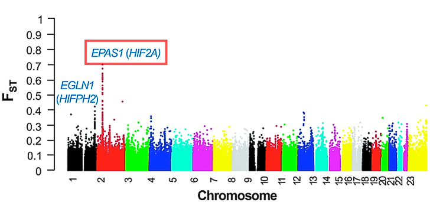</center>
  <center><p> (Hu et al., 2017) </p></center>
</div>

<div id="rsn">
  <p>29/45</p>
</div>

---
<div id="rsn">
  <p>30/45</p>
</div>

### Scénarios d'introgression

.pull-left[
  #### <center> Métissage
  

```{r, results='asis'}
method <- c("Loter",
            "HAPMIX",
            "RFMix",
            "EILA")

ref <- c(paste("Dias-Alves et al. (2017)"),
         "Price et al. (2009)",
         "Maples et al. (2013)",
         "Yang et al. (2013)")

data.frame(method = method,
           ref = ref) %>%
  knitr::kable(format = 'html', 
               col.names = c("Méthode",
                             "Référence"),
                escape = FALSE) %>%
  row_spec(c(0, 2, 4), color = "black", background = "#ffeccb") %>%
  row_spec(c(1, 3), color = "black", background = "#fffaf2")
```
]

.pull-right[
  #### <center> Flux de gènes
  
  
```{r, results='asis'}
method <- c("\\(D\\)",
            "Bd\\(_{f}\\)",
            "\\(f_d\\)",
            "\\(RND_{min}\\)")

ref <- c("Durand et al. (2011)",
         "Pfeifer et al. (2017)",
         "Martin et al. (2014)",
         "Rosenzweig et al. (2016)")

data.frame(method = method,
           ref = ref) %>%
  knitr::kable(format = 'html',
               col.names = c("Méthode",
                             "Référence")) %>%
  kableExtra::row_spec(c(0, 2, 4), color = "black", background = "#ffeccb") %>%
  kableExtra::row_spec(c(1, 3), color = "black", background = "#fffaf2")
```
]


---
<div id="rsn">
  <p>31/45</p>
</div>

### Coefficients de métissage et ACP

#### <center> (McVean, 2009)

<center>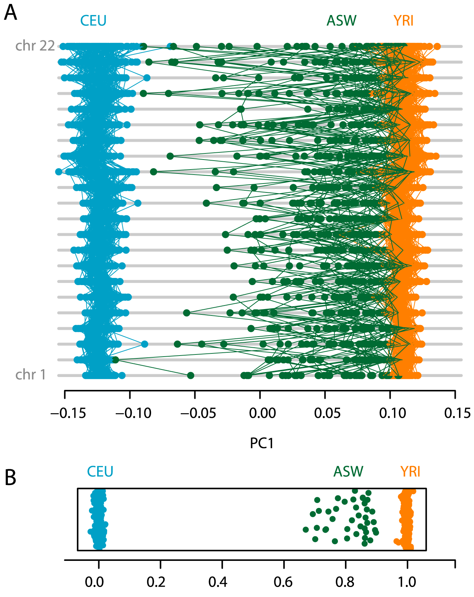</center>


---
<div id="rsn">
  <p>32/45</p>
</div>

### Scores locaux

<center>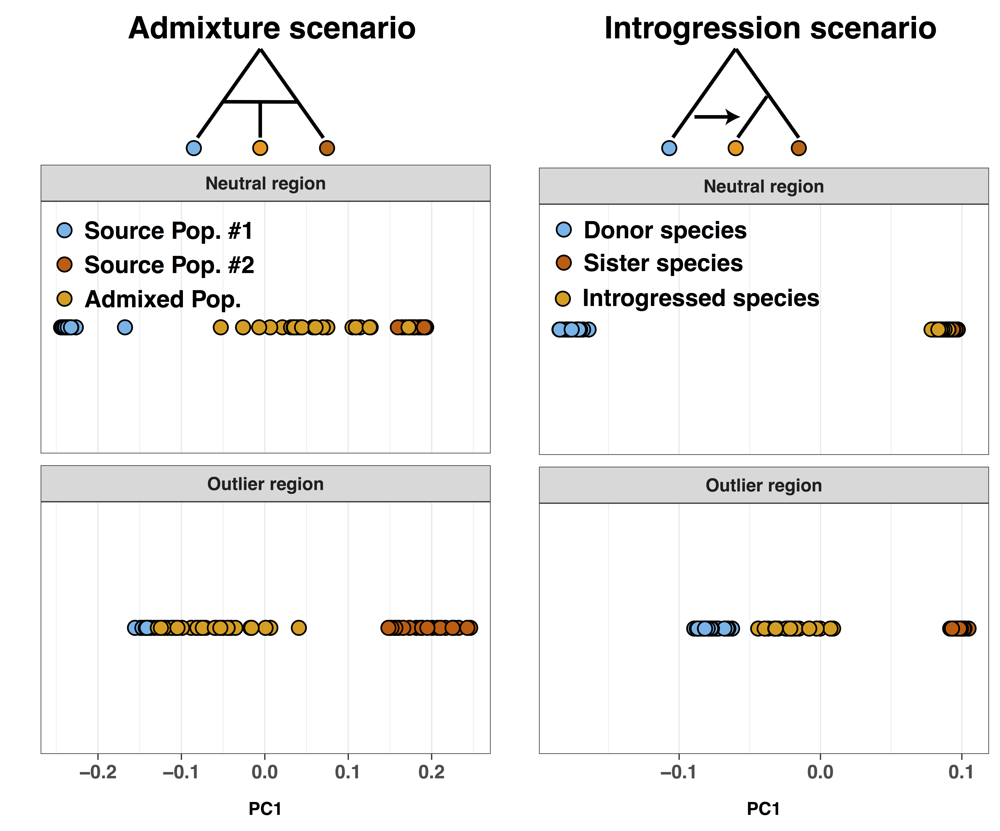</center>

---
<div id="rsn">
  <p>33/45</p>
</div>

### Méthode


- Décomposition en valeurs singulières de $\tilde{G}$


$$\tilde{G} \simeq U \Sigma V^T$$

- $B$ barycentre des individus d'une population receveuse

- $B_1$ et $B_2$ barycentres des individus des populations donneuses

--

- Calcul des coordonnées barycentriques de $B$ dans le repère $(B_1, B_2)$

$$B = q_1 B_1 + q_2 B_2$$
--

- Calcul des scores locaux sur une fenêtre de SNPs $W$ 

$$U_{W} = \tilde{G}_{.,W}V_{W,.}\Sigma^{-1}$$

--

- Calcul des proportions de métissage local pour chaque SNP à partir de $U_W$


---
<div id="rsn">
  <p>34/45</p>
</div>

### Analyse de *Populus*

#### <center> Chromosome 6 

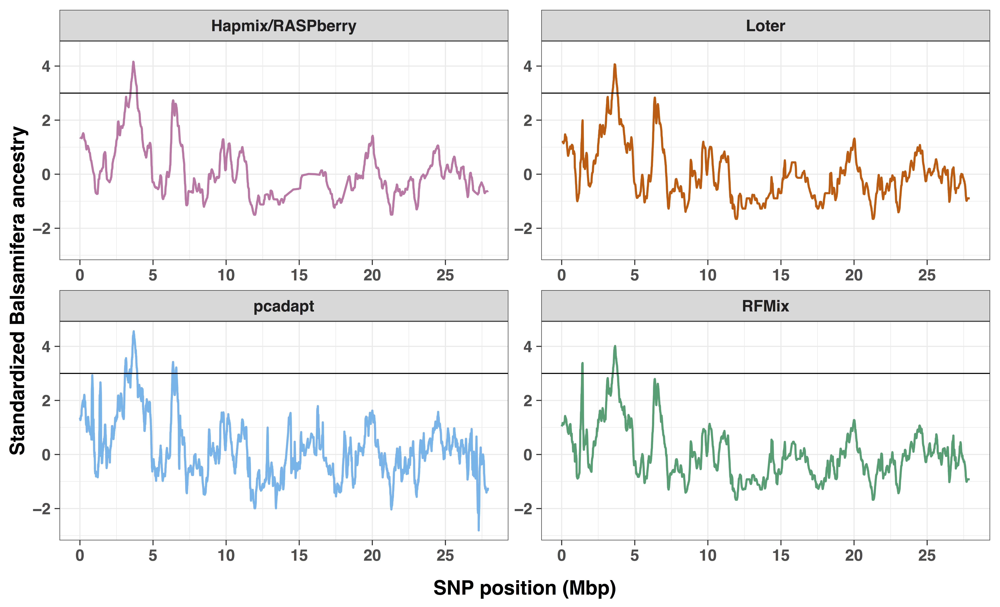


---
<div id="rsn">
  <p>35/45</p>
</div>

### Analyse de *Populus*

#### <center> Chromosome 12

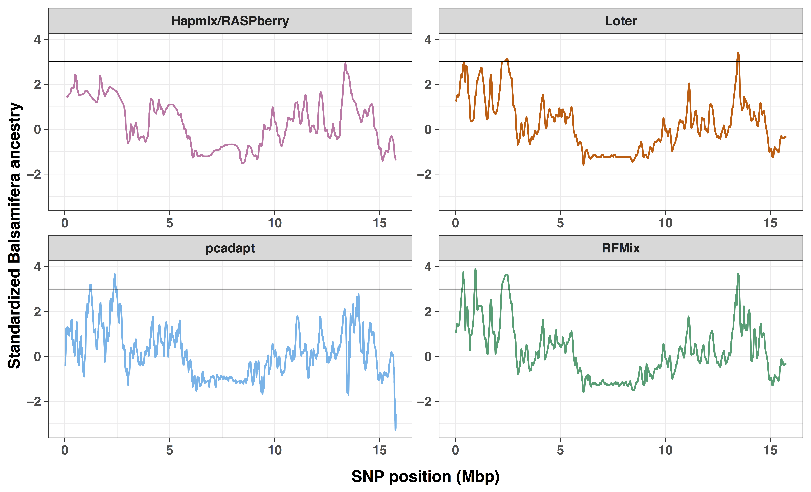


---
<div id="rsn">
  <p>36/45</p>
</div>

### Simulations

#### <center> Métissage

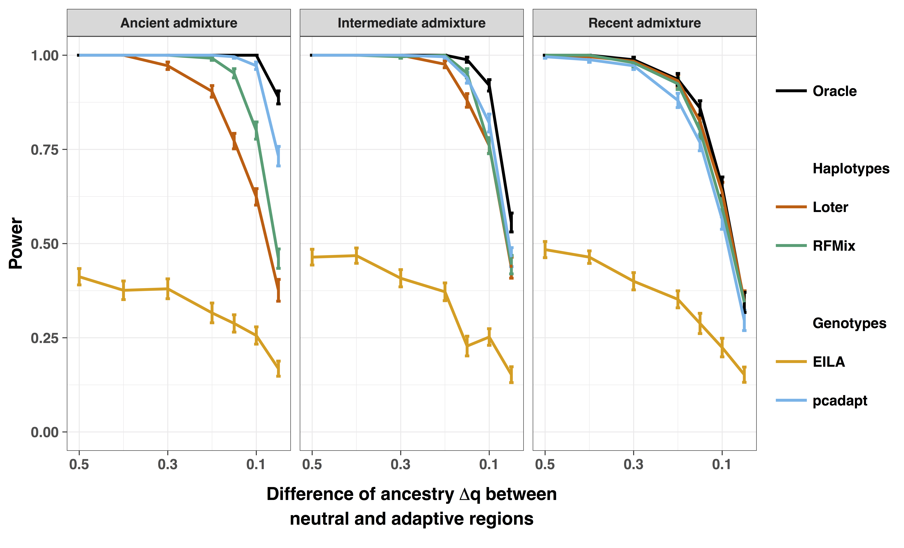


---
<div id="rsn">
  <p>37/45</p>
</div>

### Simulations

#### <center> Introgression

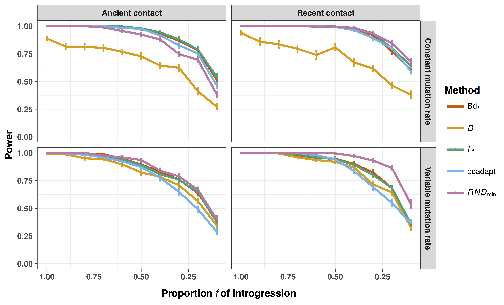


---
background-image: url("figure/Rlogo.png")
background-size: cover
class: coupure bottom

# La librairie `pcadapt`

<div id="rsn">
  <p>38/45</p>
</div>

---
<div id="rsn">
  <p>39/45</p>
</div>

### SVD et valeurs manquantes

- Fonction `svds` de la librairie `RSpectra` (IRAM)

```{r, warning=FALSE}
nIND <- c(25, 50, 100, 250, 500, 1000)
nSNP <- 10000
df <- data.frame(Method = c(rep("classic", length(nIND)),
                            rep("iram", length(nIND))),
                 nIND = nIND,
                 Time = 0)

for (i in 1:length(nIND)) {
  m <- matrix(runif(nIND[i] * nSNP), nrow = nIND[i])
  m <- scale(m)
  x <- microbenchmark::microbenchmark(
    RSpectra::svds(m %*% t(m), k = 2),
    RSpectra::svds(m, k = 2),
    times = 1,
    control = list(order = "inorder")
  )
  df$Time[df$Method == "classic" & df$nIND == nIND[i]] <- x$time[1] * 1e-9
  df$Time[df$Method == "iram" & df$nIND == nIND[i]] <- x$time[2] * 1e-9
}

df %>% 
  ggplot(aes(x = nIND, y = Time, color = Method)) +
  geom_line(size = 1) +
  geom_point(size = 2) +
  xlab("Nombre d'observations") +
  ylab("Temps (en secondes)") +
  scale_color_manual(name = "",
                     labels = c("Classique", "IRAM"),
                     values = c("#E69F00", "#0072B2")) +
  theme_bw() +
  theme(legend.position = c(0.1, 0.9))
  
```


---
<div id="rsn">
  <p>40/45</p>
</div>

### SVD et valeurs manquantes


- Fonction `svds` de la librairie `RSpectra` (IRAM)

- `Atrans`: Only used when A is a function. A is a function that calculates the matrix multiplication `A * x`, and `Atrans` is a function that calculates the transpose multiplication `A' * x`.

--

- $\left(\frac{1}{n}\tilde{G}^Tx\right)_j = \frac{1}{n} \sum_{i = 1}^n \tilde{G}_{ij} x_i$

- $\left(\frac{1}{p}\tilde{G}y\right)_i = \frac{1}{p} \sum_{j = 1}^p \tilde{G}_{ij} y_j$

---
<div id="rsn">
  <p>40/45</p>
</div>

### SVD et valeurs manquantes


- Fonction `svds` de la librairie `RSpectra` (IRAM)

- `Atrans`: Only used when A is a function. A is a function that calculates the matrix multiplication `A * x`, and `Atrans` is a function that calculates the transpose multiplication `A' * x`.


- $\left(\frac{1}{n}\tilde{G}^Tx\right)_j = \frac{1}{\sum_{i=1}^n \delta_{ij}} \sum_{i = 1}^n \tilde{G}_{ij} \delta_{ij} x_i$

- $\left(\frac{1}{p}\tilde{G}y\right)_i = \frac{1}{\sum_{j=1}^p \delta_{ij}} \sum_{j = 1}^p \tilde{G}_{ij} \delta_{ij} y_j$


---
<div id="rsn">
  <p>41/45</p>
</div>

### SVD et valeurs manquantes

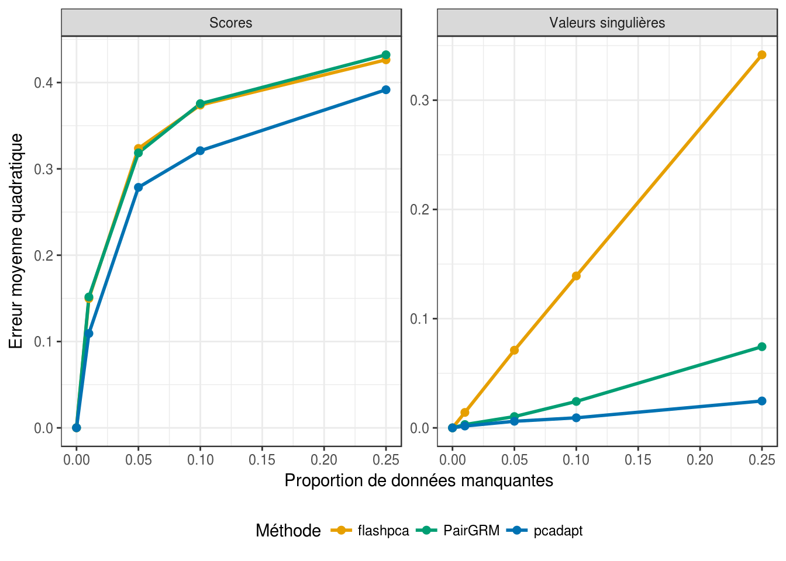

---
<div id="rsn">
  <p>41/45</p>
</div>

### Interface Shiny


```{r, eval = TRUE}
knitr::include_url("https://keurcien.shinyapps.io/app-pcadapt", height = 500)
```


---

```{r}
knitr::include_url("https://keurcien.github.io/book/details.html#rapport-entre-la-communalite-et-lindice-de-fixation", height = "600px")
```

